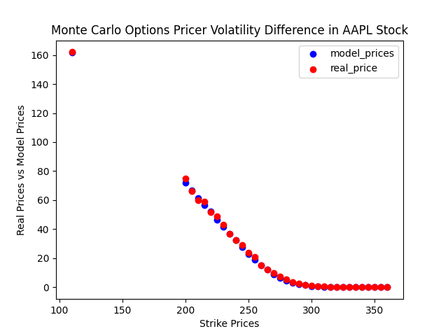

# Monte Carlo Options Pricer & Backtester

## Overview

This project aims to create a function that calculates the premimum prices of options based on mathematical concepts such as Monte Carlo method and Close Black-Scholes equation, and find a possible edge within the data. The backtester than takes the data from the Monte Carlo options pricer, and tests the method over a 21 month period and calculates the profit returns based on the strategy of mean reversion.

## How It Works

The Monte Carlo Options Pricer is built of three functions.

The first function is simply a function that takes the close price and subtracts the strike price to calculate returns, while ensuring the returns don't dip below 0 due to the option to execute the trade.

The second function utilizes the Black-Scholes equation to generate a random stock path using the variables: Z-standard normal random variable, r - the risk free rate, o - the volatility of the stock, t - time for the option to expire, and S - the starting price of the stock. This equation generates a random Geometric Brownian stock motion under fixed volatility.

And finally the third function combines both functions together and runs a large number of simluations of the function, before averaging the total returns to calculate the premium at certain strike prices for certain periods of time.

The Back Tester:

Due to historic options data including implied volatility and premium pricing being locked behind certain websites and paywalls, I created a simulated historic volatility and implied volatility during the 21 month period of January 1st, 2024 to October 10, 2025. 

The two lines of code to simulate and create the volatility use the built in rolling window function from yfinance and calculate volatility in the windows of 10 days and 60 days. Which then annuzilzes it by multiplying the variable by the square root of the total number of open market days (252).

Taking this we compared the historic volatility to the implied volatility and if the implied is greater than 135% of the historic volatility, that is a signal to sell options. Signal days is a list of every day that produces a signal.

There are two functions required for the backtester.

'AAPL' options expire every third Friday of the month, that requires a function to find based on the signal days that will find the third friday of the month. Using datatime package from Python, we find the third of the month by finding the specific day of the first of the month, calculating the days until the first Friday, and then adding 14 days to that date to find the date of the third Friday.

Due to the limitations, our second function uses the Monte Carlo Option Pricer, inputing the data of the strike price based on the signal days, as well as the time until the expiration window. The function then simply finds the profit made if someone bought that options, by comparing the strike price to the close price on the expiration date, and subtracts that profit from the simulated premium on that signal day. We then store that number in a list of profits, and the final line of code sums the entirity of the profit list to see if any money has been made.

## Volatility Comparison Chart 

Now we apply real world data, pull strike price and closing price from yfinance. We pull annualized volatility through a basic log function, taking the log of both closes, subtracting it from the previous day. Take the standard deviation and multiply it by the square root of the total number of days open in the market to annualize it. We can insert the historic volatility and run simulations off the same strike price using the Monte Carlo Option pricer and plot the predicted premium prices compared to the real ones in order to see accuracy between the two.

The model and market allign extremely well, the greatest divergence happening around the 200 dollar strike price which is very close to at the money of Apple's current stock (4/25/2026). Using this data we can conclude that the market places greater uncertainty than historic volatility when the strike price is close to the current price of the stock. 

## Backtesting Results

The backtest implimented on the Monte Carlo Options Pricer netted negative returns of 114 dollars in the 21 month long period of jan 1 2024 to october 10 2025. The back tester executed trades of selling options when implied volatility was 35% higher than historic volatility based on the concept of mean reversion; the idea that a stock / option will naturally revert back to it's average pricing. However, the signal clustered mostly in April 2025 due to a Black Swan event of across the board tariffs imposed by the Trump Administration, causing AAPL's stock to reach its peak 10 day peak volatility of 112.54%. This loss profile is consistent with known short gamma risk; the risk of accelerated losses when a stock makes a consistent directional move exacerbating a small risk into massive losses. The back test executed most of it's trades during this window, and due to the rebound of the stock, the strategy lost most of it's money in this period. 

## Limitations & Future Work

Due to this historic event, for future implementations I will put inside the code a ceiling for trades to be implemented. For example, a trade will be executed if the volatility is within the window of 35% higher and 65% higher. The idea is to avoid outliers such as the Black Swan event talked about above, in the case that volatility is so high such as April 2025, the outlier casts doubt on the strategy of mean reversion happening, due to how statistically rare the event is. Instead the model will "sit out" of this trade and only look for options to trade that are within the parameter stated above. A note to be made, due to yfinance not including historic options data such as premium, implied volatility, etc. I made use of the functions I created for the Monte Carlo Options pricer, and built in functions within the package of yfinance to create simulated implied volatility of the rolling windows of 10 days and 60 days. Future plans include updating the code to include the window that shuts out statistically unlikely events occuring, as well as getting actual historical data from behind pay walls and comparing the simulated profit returns, to real historic returns under the same parameters.
